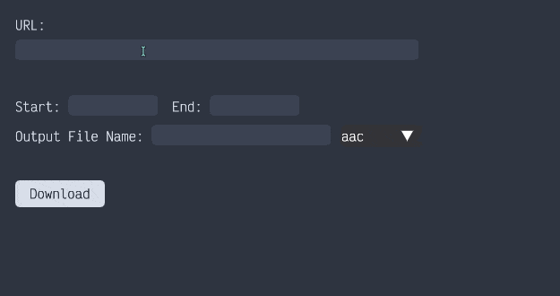

<h1 align="center"> YouTube Video to Audio </h1>

<p align="center">
A GUI application that serves to do just one thing - download and convert a YouTube video, to audio (primarily for music); with the ability to trim the file - given start/end time - so you don't have to listen to annoying intro's/outro's.
</p>

<h1></h1

Most online services nowadays have too many options which are tedious to browse through, or require subscriptions to bypass limitations on things such as the download size. Also, some videos on YouTube have unnecessary intro's/outro's which I don't want to tune into when I'm listening to music; hence this program.

## Features
- Straightforward Graphical User Interface.
- Quick YouTube to audio conversion.
- Trim/cut the audio file; download a subclip from `start` to `end`.
- Change output file-name/directory.

## Demo
</img>

## Usage

### Dependencies
Can install these via pip:
- `moviepy`
- `ffmpeg`
- `pytube`
- `dearpygui`

### Running the Program

```bash
python main.py
```

### Supported Audio Formats
- `mp3`
- `aac`

### Start/End Time Format
Start/End input value needs to be comma separated in the form of `<hr>, <sec>, <min>`. Examples of input:

```bash
# Subclip starting from 1 minute and 2 seconds
1,2
```

```bash
# Subclip starting from 15 seconds
15
```

These will be evaluated to a tuple for `moviepy`.

If nothing is entered, the program will simply convert the whole downloaded YouTube video, to audio.

### Config File
The output directory for the download is read from `config.yml` file. Simply change the string value for the `directory` key in `config.yml` to change where you want the downloaded file to go. Example:

```yaml
# config.yml
directory: "/path/to/directory/"
```

```yaml
# sending the downloaded file to downloads folder
directory: "~/Downloads"
```

Invalid directory path will be evaluated to `""` which is the directory the program itself resides in.

*Warning: Refrain from specifying the file-name in the string because this string is evaluated as a directory.*
